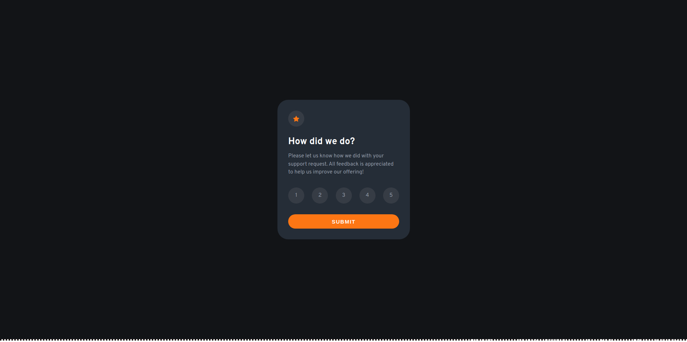

# Frontend Mentor - Interactive rating component solution

This is a solution to the [Interactive rating component challenge on Frontend Mentor](https://www.frontendmentor.io/challenges/interactive-rating-component-koxpeBUmI).

## Table of contents

- [Overview](#overview)
  - [Screenshot](#screenshot)
  - [Links](#links)
- [My process](#my-process)
  - [Built with](#built-with)
- [Author](#author)

## Overview

### Screenshot

### Links

- Solution URL: [https://github.com/markrajk/fm_interactive_rating_component](https://github.com/markrajk/fm_interactive_rating_component)
- Live Site URL: [https://markrajk.github.io/fm_interactive_rating_component/](https://markrajk.github.io/fm_interactive_rating_component/)

## My process

### Built with

- SCSS
- JS

## Author

- Website - [web-apprentice.com](https://www.web-apprentice.com/)
- Frontend Mentor - [@markrajk](https://www.frontendmentor.io/profile/markrajk)
